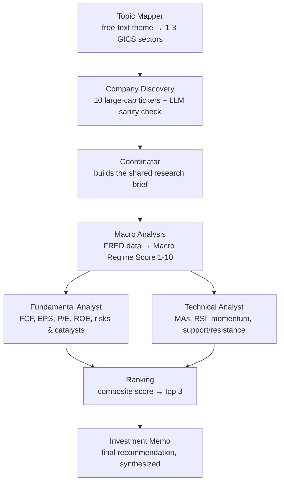

# 📈 Investment Advisory Team

**A multi-agent investment research pipeline built with [Agno](https://github.com/agno-agi/agno).**

Give it a free-text investment theme — *"AI and robotics,"* *"clean energy transition,"* *"US regional banking"* — and it will map the theme to sectors, screen 10 large-cap companies, run macro, fundamental, and technical analysis in parallel, rank the field, and hand back a professional investment memo for the top 3 picks.

> ⚠️ **This is a research/educational tool, not financial advice.** See [Disclaimer](#-disclaimer).

---

## Table of Contents

- [How it works](#how-it-works)
- [Features](#features)
- [Project structure](#project-structure)
- [Prerequisites](#prerequisites)
- [Installation](#installation)
- [Configuration](#configuration)
- [Usage](#usage)
- [Output](#output)
- [Pipeline in detail](#pipeline-in-detail)
- [Supported sectors](#supported-sectors)
- [Tech stack](#tech-stack)
- [Notes & known quirks](#notes--known-quirks)
- [Disclaimer](#-disclaimer)

---

## How it works

You give the pipeline a topic. Nine steps later, you get a ranked investment memo.



Fundamental and Technical analysis run **in parallel**, both grounded in the same macro backdrop, so the final memo reflects top-down context and bottom-up company research at once.

## Features

- **Theme → tickers, automatically.** Describe an investment idea in plain English; an LLM maps it to real GICS-style sectors and a curated list of large-cap tickers, then double-checks its own work with a sector-alignment evaluator (with retries on rejection).
- **Macro-aware analysis.** Live data from the St. Louis Fed (FRED) — fed funds rate, yield curve spread, CPI, real GDP — drives a quantitative Macro Regime Score that frames every downstream report.
- **Real fundamentals, not vibes.** Free cash flow is computed directly from yfinance cash-flow statements; P/E, ROE, income trends, and analyst consensus are pulled from Yahoo Finance.
- **Real technicals, computed in Python.** RSI (Wilder-smoothed), 50/200-day moving averages, golden/death cross detection, trend classification, momentum, and support/resistance are all computed with pandas — the LLM interprets pre-computed numbers instead of guessing at them.
- **Composite ranking.** All 10 screened companies are scored on fundamentals + technicals; the top 3 move on to the final memo.
- **Full observability.** A built-in `WorkflowTracer` logs every step, every agent call, and every hand-off between steps, then prints a data-flow map and timeline and saves a full JSON trace for later inspection.
- **Model-agnostic.** Runs on any OpenRouter-hosted model via a single environment variable — swap models without touching code.

## Project structure

```
agno_stock_analyst/
├── main.py              # CLI entry point
├── config.py             # LLM factory (OpenRouter client)
├── core/
│   ├── tracer.py          # WorkflowTracer — logging, data-flow map, timeline, JSON trace
│   └── utils.py            # Score extraction, LLM fallback ranking, sector parsing
├── data/
│   └── sectors.py          # Sector vocabulary + curated large-cap ticker universe
├── tools/
│   ├── macro.py             # FRED API client
│   ├── fundamental.py        # Free cash flow calculation (yfinance)
│   └── technical.py           # Technical indicator engine (pandas)
├── workflow/
│   ├── agents.py             # Agent definitions (Macro, Fundamental, Technical, Strategist)
│   ├── steps.py               # Step executors (Topic Mapper, Discovery, Ranking, Synthesis…)
│   └── pipeline.py             # Assembles all steps into the Agno Workflow
└── requirements.txt
```

## Prerequisites

- Python 3.10+
- An [OpenRouter](https://openrouter.ai) API key (the pipeline talks to LLMs exclusively through OpenRouter's OpenAI-compatible endpoint)
- A free [FRED API key](https://fred.stlouisfed.org/docs/api/api_key.html) for macroeconomic data

## Installation

```bash
git clone https://github.com/JocelynWang0414/agno_stock_analyst.git
cd agno_stock_analyst
pip install -r requirements.txt
```

## Configuration

Create a `.env` file in the project root:

```dotenv
OPENROUTER_API_KEY=sk-or-v1-...
OPENROUTER_MODEL=google/gemini-2.5-flash-lite
FRED_API_KEY=...
```

| Variable | Required | Description |
|---|---|---|
| `OPENROUTER_API_KEY` | ✅ | Your [OpenRouter](https://openrouter.ai) key — powers every agent in the pipeline. |
| `OPENROUTER_MODEL` | ✅ | Any [OpenRouter model ID](https://openrouter.ai/models), e.g. `google/gemini-2.5-flash-lite`, `anthropic/claude-3.5-sonnet`, `openai/gpt-4o-mini`. |
| `FRED_API_KEY` | ✅ | Free key from the [St. Louis Fed](https://fred.stlouisfed.org/docs/api/api_key.html), used for macro data. Without it, the Macro Analysis step still runs but reports the data as unavailable. |

## Usage

```bash
python main.py --topic "AI and robotics"
python main.py --topic "clean energy transition"
python main.py --topic "US regional banking"
```

If you omit `--topic`, it defaults to `"large-cap technology companies"`.

While it runs, you'll see a live, color-coded trace in your terminal — sector mapping, ticker screening, macro data fetches, parallel analyst calls, and the final ranking — followed by a data-flow summary and a step-by-step timing breakdown.

## Output

Each run produces two files in the project root:

| File | Contents |
|---|---|
| `memo_<topic>_<TICKERS>.md` | The final investment memo: executive summary, macro backdrop, a scorecard table for the top 3, ranked recommendations with rationale, key risks, suggested position sizing, and a disclaimer. |
| `trace_<topic>.json` | A complete, machine-readable log of the run — every step, every agent input/output, and every inter-step data hand-off, with timestamps. Useful for debugging or auditing a specific analysis. |

## Pipeline in detail

| Step | What happens |
|---|---|
| **Topic Mapper** | An LLM maps your free-text theme to 1–3 sectors from a fixed, GICS-aligned vocabulary. |
| **Company Discovery** | Up to 10 large-cap tickers are drawn from a curated per-sector universe. A second LLM call sanity-checks whether the tickers actually fit the theme; on a clear mismatch it suggests alternate sectors and the pipeline retries (up to 2 times) before proceeding with its best result. |
| **Coordinator** | Assembles a shared research brief (theme, sectors, tickers) that downstream agents consume. |
| **Macro Analysis** | Pulls fed funds rate, 10Y–2Y yield spread, CPI, and real GDP from FRED, then has a Macro Analyst agent classify the economic cycle, assess sector sensitivity, and assign a **Macro Regime Score (1–10)**. |
| **Fundamental Analyst** *(parallel)* | For each ticker: pulls valuation, profitability, and income-statement data via yfinance, computes free cash flow trend, summarizes analyst consensus, and assigns a **Fundamental Score (1–5)**. |
| **Technical Analyst** *(parallel)* | For each ticker: computes RSI, moving averages, golden/death cross, trend, momentum, and support/resistance in pandas, then assigns a **Technical Score (1–5)**. |
| **Ranking** | Combines fundamental + technical scores into a composite score per ticker and selects the top 3. Falls back to an LLM-based ranking if score extraction fails for more than half the tickers. |
| **Investment Memo** | A Portfolio Strategist agent synthesizes the macro backdrop, and the top 3 companies' fundamental and technical reports into a polished investment recommendation memo. |

## Supported sectors

`Technology` · `Healthcare` · `Energy` · `Financials` · `Consumer Cyclical` · `Consumer Defensive` · `Industrials` · `Basic Materials` · `Real Estate` · `Utilities` · `Communication Services`

## Tech stack

- [**Agno**](https://github.com/agno-agi/agno) — multi-agent orchestration (`Workflow`, `Step`, `Parallel`)
- [**yfinance**](https://github.com/ranaroussi/yfinance) — market data, fundamentals, and cash-flow statements
- [**OpenRouter**](https://openrouter.ai) — model-agnostic LLM gateway
- [**FRED API**](https://fred.stlouisfed.org) — macroeconomic time series
- **pandas** — technical indicator computation

## Notes & known quirks

- Company Discovery draws from a **curated, static ticker list** (`data/sectors.py`) rather than a live screener — no additional screener API key is needed to run the project despite what the internal error messages might suggest.
- The default model (`google/gemini-2.5-flash-lite`) doesn't reliably handle multi-ticker prompts in a single call, so the Fundamental and Technical Analyst steps loop one ticker at a time. If you swap in a stronger model, this still works fine — it's just slightly less token-efficient.
- Technical indicators are fetched with `yf.Ticker(...).history()` rather than `yf.download()` to avoid yfinance's request-batching behavior silently dropping tickers under concurrent load.

## ⚠️ Disclaimer

*This project is for educational and research purposes only. It does not constitute financial advice, and nothing it produces should be relied upon for investment decisions. Always do your own research and consult a licensed financial advisor before investing.*
